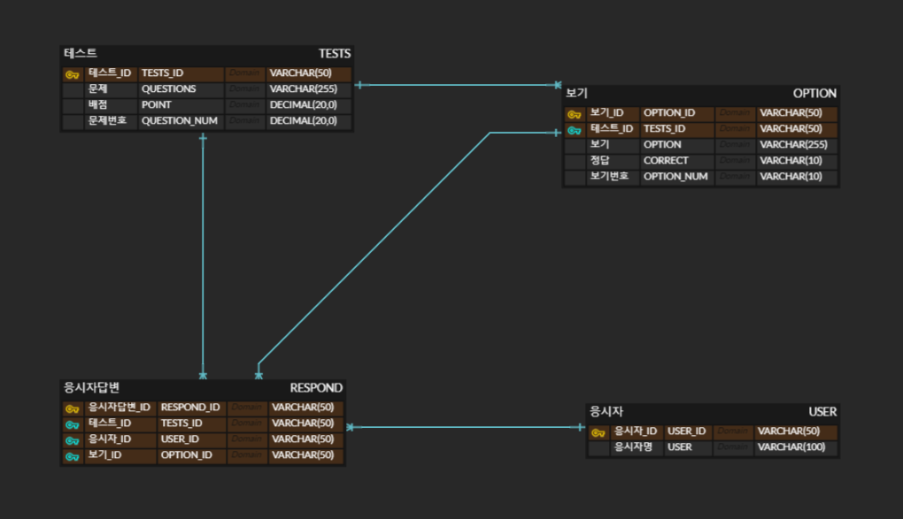

## 시험 문제 출제, 문제 풀이 및 점수 산정 프로그램 제작

### 프로젝트 개요
|구분|내용|
|--|--|
|기간|2024.04.02 ~ 2024.04.04|
|인원|조유경, 김덕재|
|내용|시험 문제와 보기 문항을 입력받아 DB에 저장한 다음, <br> 사용자 이름을 입력받아 사용자가 응시한 정보를 저장하여, <br> 그 정보를 기반으로 점수와 응시자 평균 점수를 출력하는 프로그램의 제작|
|담당|조유경 : 시험 문제 입력 및 저장, 응시자 별 점수 출력 및 응시자 전체 평균 산출 <br> 김덕재 : 시험 문제 출력 및 응시 정보 저장, 영상 제작|
|결과영상|[Youtube Link](https://www.youtube.com/watch?v=RyOrkZEqAyM)|

### 사용 툴
   

### 프로젝트 결과물
- ERD 
 + 
- 결과 영상
 + [Youtube Link](https://www.youtube.com/watch?v=RyOrkZEqAyM)


### File 정리본
|구분|파일명|파일설명|담당자|링크|
|--|--|--|--|--|
|1|basic.sql|Table 확인용 query문|조유경|[basic.sql](./toy_ERDs/files_query/basic.sql)|
|2|SELECT_AND_DELETE_TABLES.sql|Table 확인용 query문|김덕재|[SELECT_AND_DELETE_TABLES.sql](./toy_ERDs/files_query/SELECT_AND_DELETE_TABLES.sql)|
|3|CREATE_TABLES.sql|필요한 Table 생성 query문|김덕재|[solve_test_djkim.py](./toy_ERDs/files_query/CREATE_TABLES.sql)|
|4|GET_QUIZ_GET_ANSWER.sql|출제 문제 및 보기 DB 가져오기 query문|김덕재|[GET_QUIZ_GET_ANSWER.sql](./toy_ERDs/files_query/GET_QUIZ_GET_ANSWER.sql)|
|5|RESPOND_CALCULATE.sql|응시자별 점수 구하기 & 전체응시자 평균 구하기 query문|김덕재|[RESPOND_CALCULATE.sql](./toy_ERDs/files_query/RESPOND_CALCULATE.sql)|
|6|scoring_query.sql|응시자별 점수 구하기 & 전체응시자 평균 구하기 query문|조유경|[scoring_query.sql](./toy_ERDs/files_query/scoring_query.sql)|
- query 파일 정리본
|구분|파일명|파일설명|담당자|링크|
|--|--|--|--|--|
|1|main.py|메인 : 각종 function 호출|조유경|[main.py](./toy_ERDs/main.py)|
|2|making_test_yugyeongjo.py|시험 문제 및 보기 출제 후 DB에 저장|조유경|[making_test_yugyeongjo.py](./toy_ERDs/making_test_yugyeongjo.py)|
|3|solve_test_djkim.py|문제 응시 후 응시자별 응시내용 DB에 저장|김덕재|[solve_test_djkim.py](./toy_ERDs/solve_test_djkim.py)|
|4|test_scoring_yugyeongjo.py|응시자별 응답내용 채점 후 총합 계산 & 응시자 전체 평균 출력|조유경|[test_scoring_yugyeongjo.py](./toy_ERDs/test_scoring_yugyeongjo.py)|

## Setting
<details>
<summary>Click!</summary>

#### Main package
- java:17
- mysql:8

#### CLI with Dockerfile and compose.xml : duration 150.4s
```
# --project-name is docker container name

Docker installation command copied
~$ docker-compose --project-name python__mysql up -d --build

Docker reinstallation command copied
~$ docker-compose --project-name python__mysql build --no-cache
~$ docker-compose --project-name python__mysql up -d
```
#### samples
- [samples/python_mysql.py](./samples/python_mysql.py)

#### database infors
+ user='cocolabhub',
+ password='cocolabhub',
+ db='python_mysql'
</details>